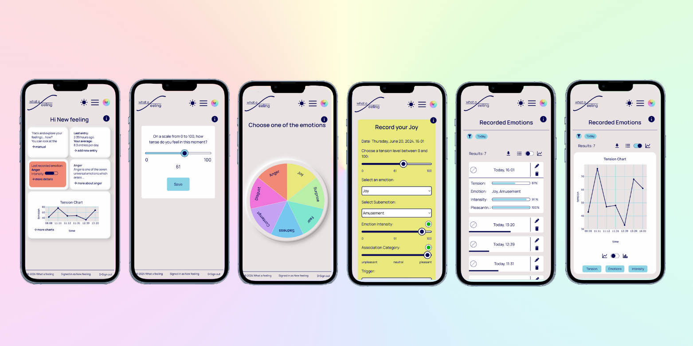

# Capstone Project: What A Feeling - Emotion Tracker

What A Feeling is an emotion tracker - an app which helps people to track, analyse and understand their feelings.

The idea behind the app is based on the concept of the seven basic emotions by Paul Ekman.

It adresses people who are attending behaviour therapy but can also be generally used by everyone who wants to explore themselves.

It features a guided emotion logging, pretty data visuals, analytics as lists and charts, options for downloading and last but not least a cozy homefeeling with a theme of your choice.

## Demo:

You can find the hosted version on Vercel: [Demo Version of What a Feeling](https://what-a-feeling.vercel.app/)

**Important:** This App was developed mobile-first and was made responsive for a broad range of devices. You can also install it using the PWA feature.

## Tech Stack

- React
- Next.JS
- React/Next Hooks
- nextAuth
- JavaScript
- styled-components
- mongoDB
- Node.js
- Vercel
- Progressive Web App
- Libraries:
  - plotly
  - mongoose
  - fuse.js
  - swr
  - hamburger-react
  - date-fns
  - i18next
  - react-day-picker
  - react-export-table

## The Team

- [Sonja Lerchl](https://github.com/ladydarkja)
- [Jana May](https://github.com/janaRicarda)
- [Christof Röhl](https://github.com/Xristof23)
- [Jan Schwarz](https://github.com/JanPSchwarz)

## Project Setup

- Clone this repository
- Install all dependencies with `$ npm install`
- Run app in dev mode with `$ npm run dev`
- Server: [http://localhost:3000/](http://localhost:3000/)
- only usable in demo-mode without api keys
